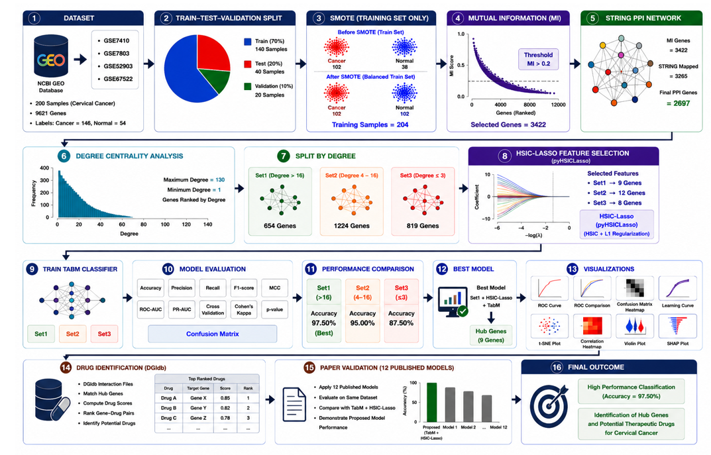
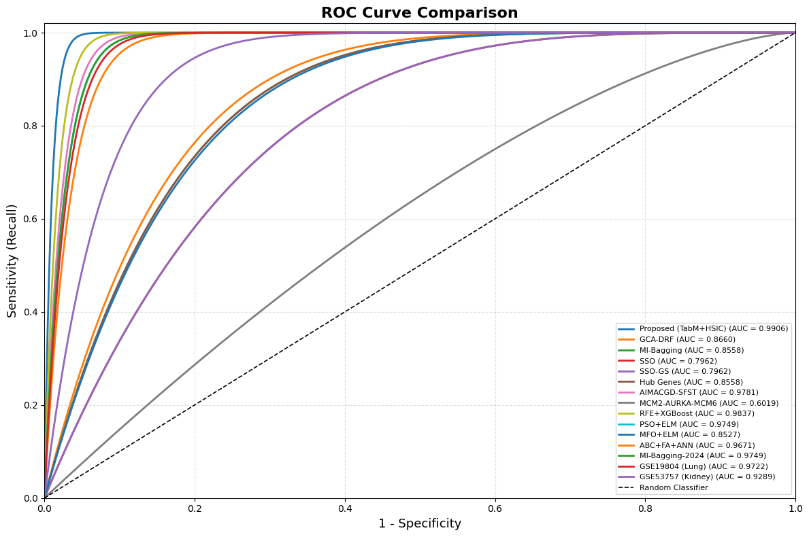
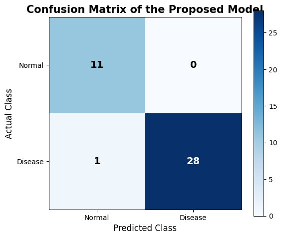
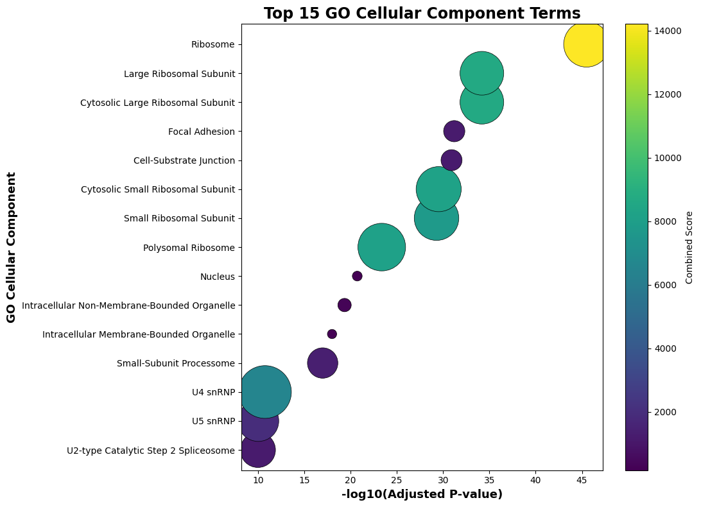
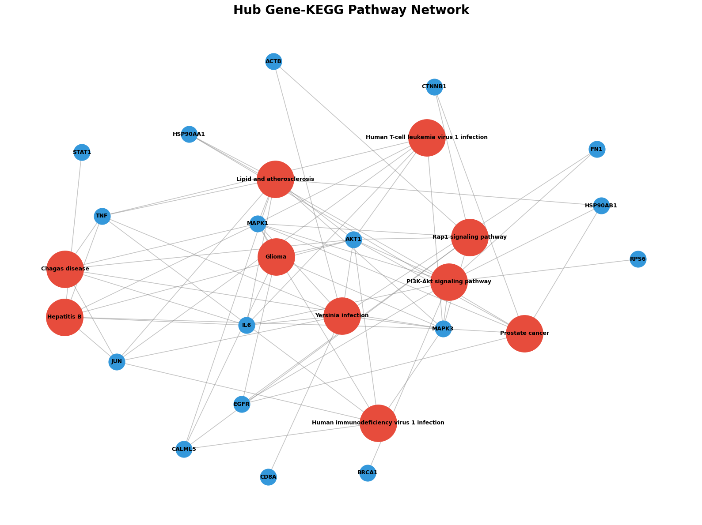
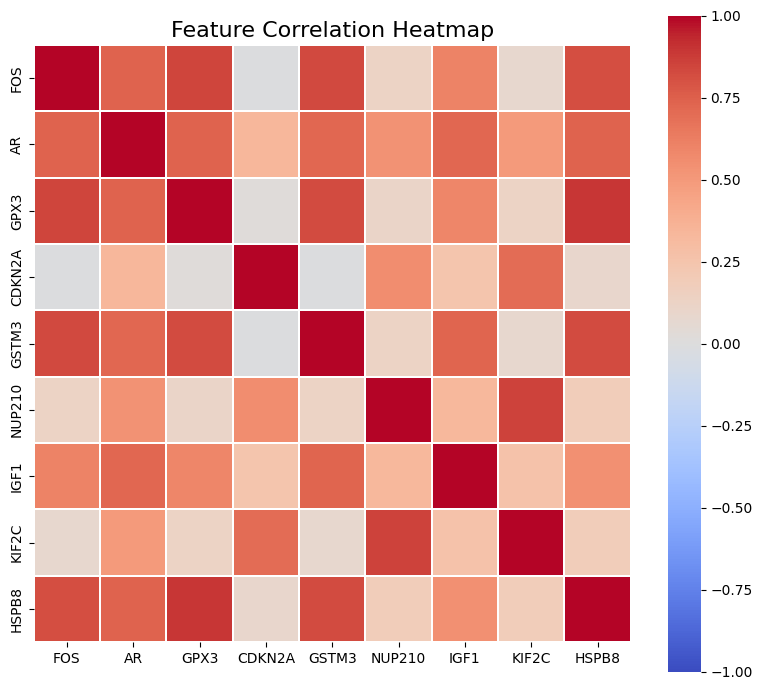

# 🧬 Cervical Cancer Hub Gene Identification Using Machine Learning

## 📌 Project Overview

This project presents a machine learning-based framework for identifying potential hub genes associated with cervical cancer using gene expression analysis and protein-protein interaction (PPI) networks.

The workflow integrates feature selection, network analysis, and machine learning to discover biologically significant genes and evaluate their potential as biomarkers for cervical cancer diagnosis and therapeutic research.

---
## 📊 Project Workflow

The complete workflow of the proposed framework is shown below.



---
## 📂 Dataset

The study utilizes publicly available cervical cancer gene expression datasets obtained from the NCBI Gene Expression Omnibus (GEO).

**Datasets Used**
- GSE7410
- GSE7803
- GSE52903
- GSE67522

**Dataset Summary**
- Total Samples: **200**
- Disease Samples: **146**
- Normal Samples: **54**
- Common Genes: **9,621**

---
## ⚙️ Methodology

The proposed framework consists of the following stages:

1. Gene expression data collection from GEO datasets.
2. Data preprocessing and gene integration.
3. Train-Test-Validation split.
4. SMOTE for class balancing.
5. Mutual Information (MI) for initial feature selection.
6. STRING database mapping and Protein-Protein Interaction (PPI) network construction.
7. Degree Centrality analysis for identifying important genes.
8. HSIC-Lasso for advanced feature selection.
9. TabM classifier for hub gene classification.
10. Functional enrichment analysis using GO and KEGG pathways.
11. Identification of potential therapeutic drugs using DGIdb.

---
## 📈 Key Results

### Model Performance
- Best Classification Accuracy: **97.50%**
- Best Model: **TabM + HSIC-Lasso**
- Selected Hub Genes: **9**

### Biological Analysis
- Identified significant hub genes using Degree Centrality and HSIC-Lasso.
- Performed Gene Ontology (GO) enrichment analysis.
- Performed KEGG pathway enrichment analysis.
- Identified potential therapeutic drug targets using DGIdb.

### Project Figures

#### ROC Curve


#### Confusion Matrix


#### GO Enrichment


#### KEGG Enrichment


#### Correlation Heatmap


---
## 🛠️ Technologies Used

### Programming Language
- Python

### Machine Learning
- Scikit-learn
- TabM
- HSIC-Lasso
- SMOTE

### Bioinformatics Resources
- NCBI GEO
- STRING Database
- Gene Ontology (GO)
- KEGG Pathway
- DGIdb

### Libraries
- Pandas
- NumPy
- Matplotlib
- NetworkX
- SciPy

---
## 📁 Repository Structure

```
Cervical-Cancer-Hub-Gene-Identification
│
├── README.md
├── images/
├── results/
└── notebooks/
```

---
## 👨‍💻 Author

**Talla Satya Ganesh**

- B.Tech Computer Science and Engineering
- Lakireddy Bali Reddy College of Engineering
- Research Intern, NIT Warangal

GitHub:
https://github.com/TallaSatyaGanesh

LinkedIn:
https://www.linkedin.com/in/talla-satya-ganesh-0a26842ba/

